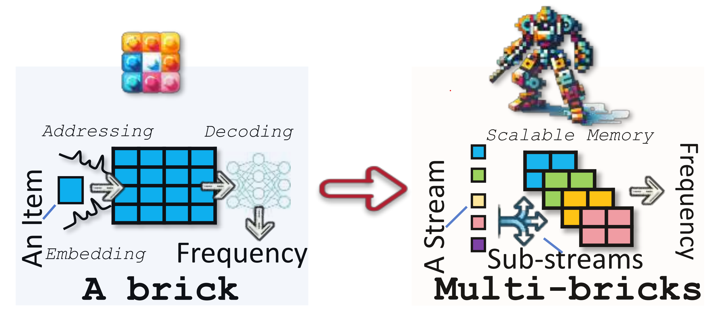
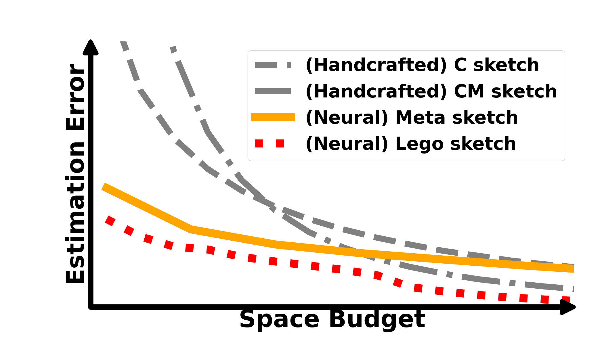

# Lego Sketch: A Scalable Memory-augmented Neural Network for Sketching Data Streams


Lego Sketch utilizes scalable memory-augmented neural networks (MANN) to store data streams, enabling future approximate item-frequency queries—a process known as sketching streams.  This research falls into the emerging category of neural sketch methods, aiming to replace traditional rule-based handcrafted sketches with a self-supervised end-to-end training paradigm. By implementing notable architectural improvements, it overcomes the scalability challenges of previous neural sketches, eliminates the need for frequent retraining, and achieves substantially lower prediction errors.
 
## Scalable Memory of Lego Sketch


## Comparison of Estimation Errors



## How to Train a Lego Brick
To train the Lego Brick model, navigate to the following directory and execute the command:
```
cd Lego/ExpCode/Lego_brick

python Lego_seed0.py
```

## Eval Lego Sketch on Synthetic Data
To facilitate accuracy testing, we provide synthetic datasets with different skewness levels and two Lego Brick instances (trained under random seeds 0 and 1). You can directly test them using the following command, and the results will be saved in the Figure folder.

```
cd Lego/EvalDataset

python Test_Lego.py
```

